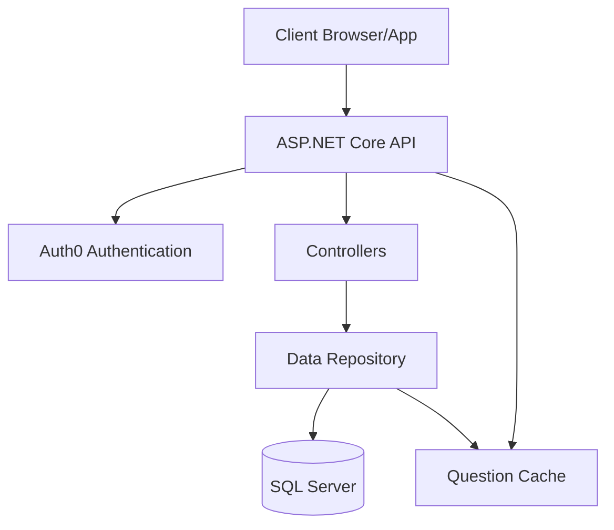
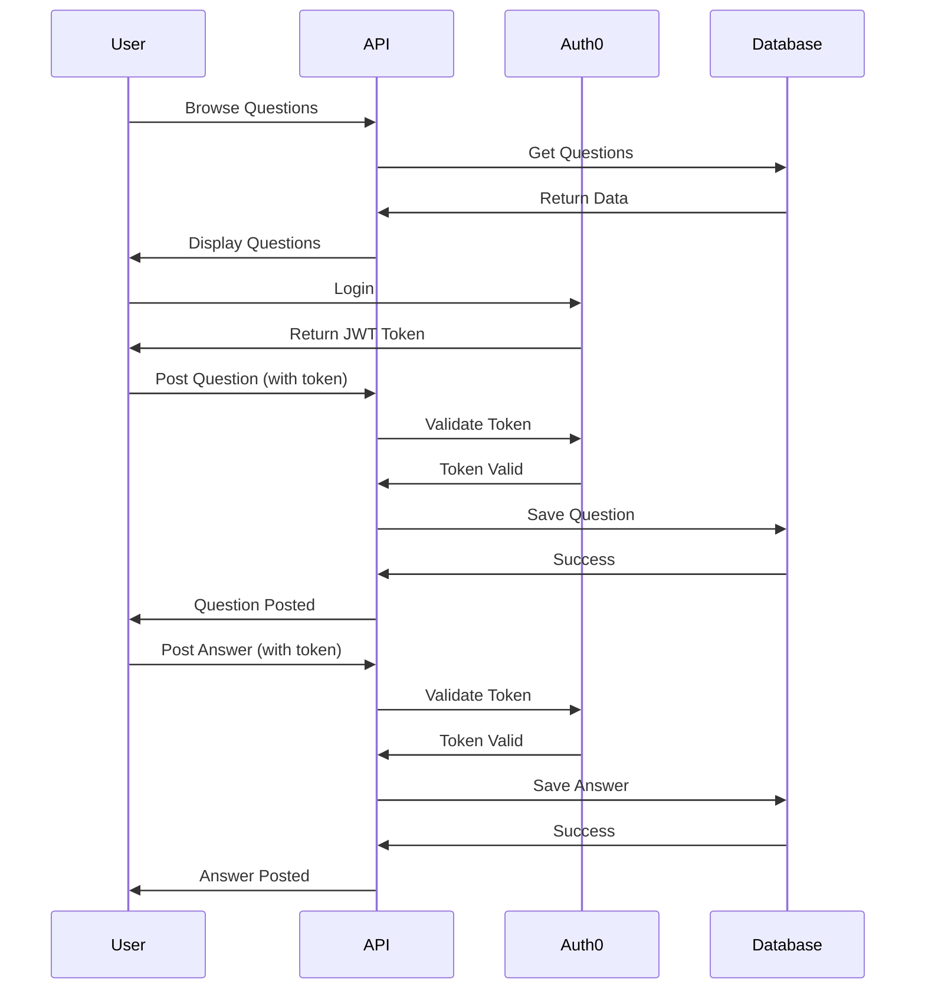
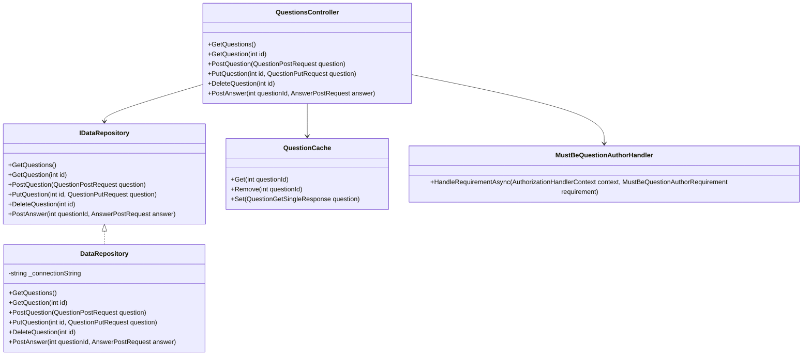

# FullstackDotNetCore

**Created by: Aashish Kumar**

A simple Question and Answer application built with .NET Core, Dapper, and SQL Server. This app lets users post questions, submit answers, and manage their content with full authentication.

## What This App Does

- Users can browse questions without logging in
- Registered users can ask new questions
- Registered users can answer questions
- Question owners can edit or delete their questions
- Authentication is handled through Auth0

## Technical Details

### Packages Used

| Package | Version | Purpose |
|---------|---------|---------|
| Microsoft.AspNetCore.Authentication.JwtBearer | 9.0.2 | Handles JWT authentication |
| Swashbuckle.AspNetCore | 7.3.1 | Provides Swagger documentation |
| Dapper | 2.1.66 | Lightweight ORM for database access |
| Microsoft.Data.SqlClient | 6.0.1 | SQL Server database connection |
| DbUp | 5.0.41 | Database migration tool |

### Database Design

The database uses SQL Server with the following main tables:
- Questions
- Answers
- Users

### Architecture Diagram



### Application Flow



### Class Diagram



## How to Run the Project

### Prerequisites
- .NET 9.0 SDK
- SQL Server instance (local or cloud-based)
- Auth0 account (for authentication)

### Database Setup
Choose one of the following options:

#### Option 1: Azure SQL Database (Recommended for Mac users)
1. Create a free [Azure account](https://azure.microsoft.com/en-us/free/)
2. Provision an Azure SQL Database
   - In the Azure portal, create a new SQL Database
   - Select a pricing tier (Basic tier is sufficient for development)
   - Set up a server admin username and password
   - Configure firewall rules to allow your IP address
3. Get the connection string from the Azure portal and update your appsettings.json

#### Option 2: AWS RDS for SQL Server
1. Create an [AWS account](https://aws.amazon.com/free/)
2. Launch an RDS SQL Server instance
3. Configure security groups to allow connections from your IP
4. Use the endpoint and credentials to update your connection string

#### Option 3: Docker Container (local option)
```bash
docker run -e "ACCEPT_EULA=Y" -e "MSSQL_SA_PASSWORD=YourStrongPassword!" -p 1433:1433 -d mcr.microsoft.com/mssql/server:2022-latest
```

The application will automatically create the database and run the migration scripts on startup once you can connect to SQL Server.

### Configuration
1. Copy `appsettings.example.json` to `appsettings.json`
2. Update the connection string with your SQL Server details
3. Configure Auth0 settings with your Auth0 account details:
   - Authority: Your Auth0 domain (e.g., https://yourdomain.auth0.com/)
   - Audience: Your API identifier

### Running the Application
1. Restore NuGet packages: `dotnet restore`
2. Build the application: `dotnet build`
3. Run the application: `dotnet run`
4. Access the API via Swagger: https://localhost:7227/swagger

## Project Structure
- **Controllers/**: API endpoints
- **Data/**: Data access layer with repository pattern
- **Models/**: Data models
- **Authorization/**: Custom authorization handlers
- **SQLScripts/**: SQL migration scripts (run automatically on startup)

## Development Approach

This project follows a clean architecture pattern with separation of concerns:
1. **Controllers** handle HTTP requests and responses
2. **Repository** layer manages data access
3. **Models** define the data structure
4. **Authorization** handles permissions and security

DbUp handles database migrations automatically when the app starts, creating all necessary tables and stored procedures.
